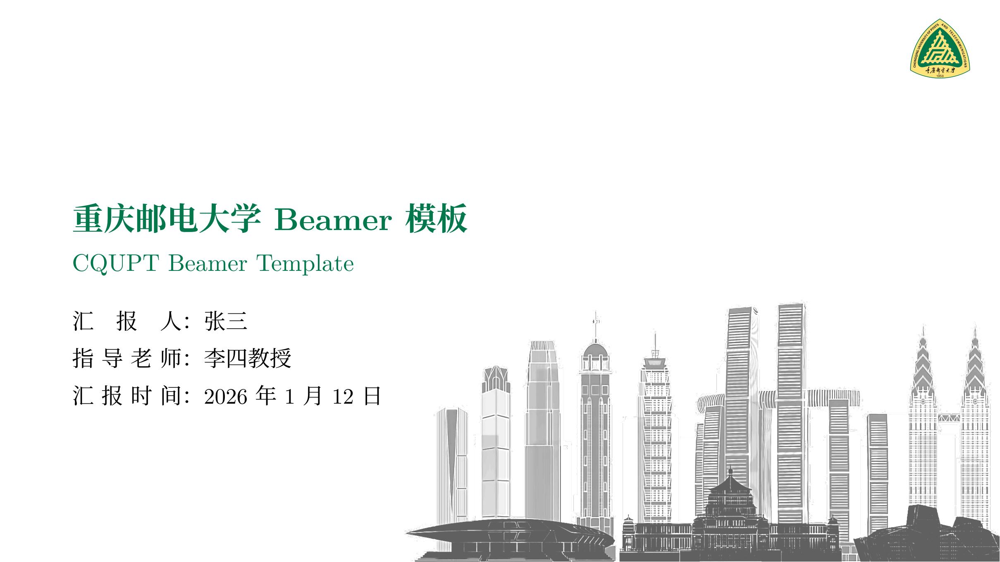

## 🎉 简介

<p align="left">
  
  
</p>

重邮 LaTeX Beamer 模板（CQUPT-Beamer-Template）【非官方】

> 💡 本项目基于【<u>[liu-qilong/college-beamer](https://github.com/liu-qilong/college-beamer)</u>】进行二次开发。


## 📌 模板预览

<p align="center">
  
</p>


## ✨ 主要特性

* **视觉识别**：内置 CQUPT 标准校徽，配色方案严格遵循重邮标准视觉色彩。

* **经典主题**：基于 `CambridgeUS` 主题深度优化，兼顾学术严谨性与排版美感。

* **中文友好**：默认适配 `XeLaTeX` 编译环境，集成 `xeCJK` 宏包，解决中文乱码问题。

* **开箱即用**：预设数学公式、高亮代码块、多栏排版、文献引用等常用模块示例。


## 🚀 快速开始

1.  **下载**：点击本仓库右上角 `Code` -> `Download ZIP` 下载代码压缩包。

2.  **上传**：登录 [Overleaf](https://www.overleaf.com/)，创建新项目并上传该 ZIP 包。

3.  **配置**：在 Overleaf 左下角点击 `Settings`，将 **Compiler** 设置为 **XeLaTeX**。

4.  **编写**：打开 `main.tex` 修改内容，点击 `Recompile` 即可预览。


## 📂 文件结构

```text
.
├── main.tex           # ✍️ 主编辑文件（在此修改幻灯片内容）
├── assets/            # 📦 资源目录
│   ├── imgs/          # 存放校徽 (logo.png)、插图等
│   └── cqupt.sty      # 🎨 核心样式 (定义颜色、页眉页脚及宏包配置)
└── README.md          # 说明文档
```


## ⚠️ 免责声明

1. 非官方性质：本项目仅为个人开发的 LaTeX 模板，并非学校官方发布。

2. 请使用者在使用本模板制作学术报告或答辩 PPT 时，务必遵守学校相关的规范及学术诚信要求。

3. 因使用本模板产生的任何学术、法律或形象上的争议，由使用者自行承担，与模板作者及学校无关。


## ⚖️ 许可证与致谢

* 本项目遵循 **[CC BY 4.0 License](https://creativecommons.org/licenses/by/4.0/)**。您可以自由共享、修改，但请保留原作者及本仓库的署名。

* 致谢：核心代码修改自【<u>[liu-qilong/college-beamer](https://github.com/liu-qilong/college-beamer)</u>】。感谢原作者对社区的贡献。
